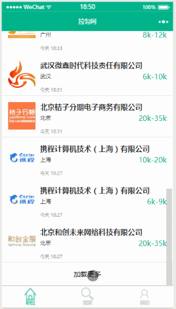

## 项目说明
本项目是仿拉钩web端的微信小程序代码，后端代码请看这里[仿拉钩微信小程序nodejs服务端](https://github.com/guojingfeng1994/lagou-node)

### 说明
* 项目使用ES6代码进行编写
* 项目使用原生小程序API编写，未使用wepy框架进行构建（因为理解原理，框架才可以使得得心应手啊^_^）
* 目前未登录就可以使用的功能已基本实现，登录后的功能暂时不实现，因为目前后端接口爬取数据耗时太长，所以登陆后的部分功能暂不打算使用真实数据

#### screenshot

#### 微信开发者工具 v1.01.170925
